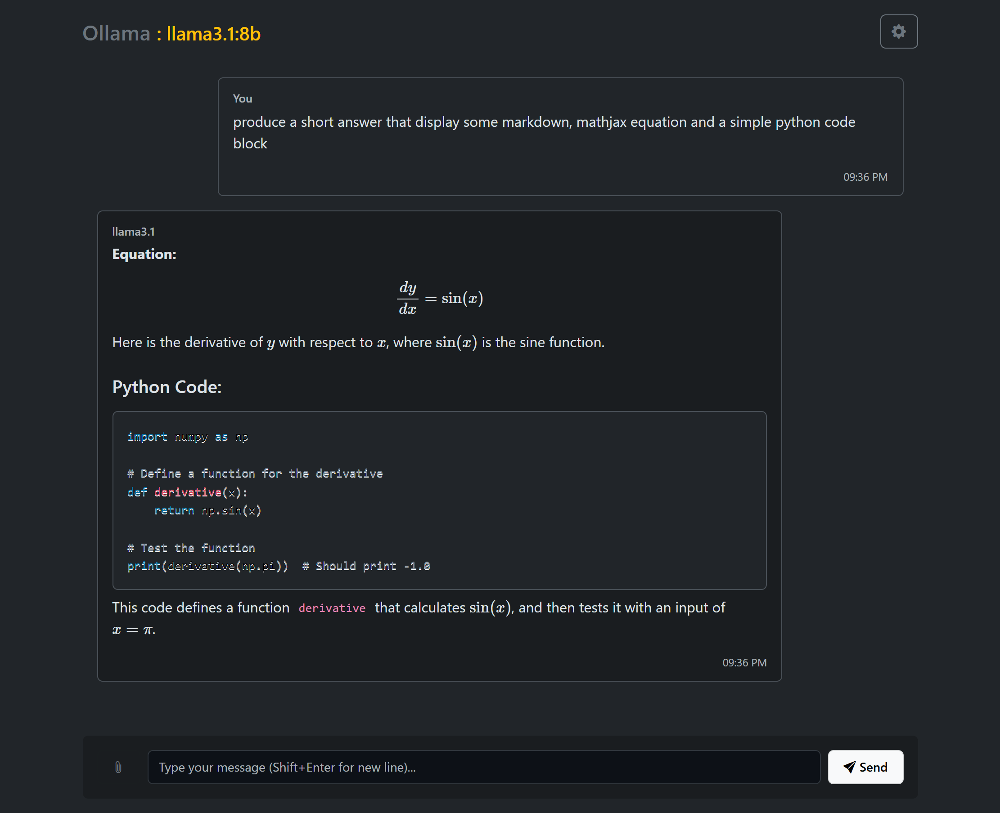

# Ollama Chat UI

A modern, feature-rich web interface for interacting with Ollama AI models. This application provides a clean, user-friendly chat interface with support for code highlighting, file attachments, and markdown rendering.



## Features

- 🎨 Clean, modern dark theme UI
- 💬 Real-time streaming responses
- 🔤 Markdown and MathJax support
- 💻 Code syntax highlighting with copy functionality
- 📎 File attachment support
  - Image preview and thumbnails
  - Text file content extraction
  - PDF text extraction
- ⚙️ Configurable settings
  - Model selection
  - API URL configuration
  - Custom system prompts
- 📱 Responsive design

## Prerequisites

- [Ollama](https://ollama.ai/) installed and running locally or on a server
- A modern web browser
- Web server for hosting (or run locally)

## Setup

1. Clone this repository:
```powershell
git clone [your-repository-url]
cd OllamaChat
```

2. Configure your Ollama server:
   - By default, the UI connects to `http://localhost:11434`
   - You can change the API URL in the settings (gear icon)

3. Serve the files:
   - You can use any web server to host the files
   - For development, you can use Python's built-in server:
```powershell
python -m http.server 8000
```

4. Access the application:
   - Open your browser and navigate to `http://localhost:8000`

## Usage

1. **Select a Model**:
   - Click the settings icon (⚙️)
   - Choose from available Ollama models
   - Optionally set a system prompt

2. **Chat Interface**:
   - Type messages in the input field
   - Use Shift+Enter for new lines
   - Click Send or press Enter to submit

3. **File Attachments**:
   - Click the paperclip icon or drag & drop files
   - Supports images, text files, and PDFs
   - Images are displayed as thumbnails
   - Text content is extracted and included in the prompt

4. **Code Blocks**:
   - Syntax highlighting for various languages
   - Copy button appears on hover
   - Triple backticks for code fence

## Project Structure

- `index.html` - Main HTML file
- `styles.css` - CSS styles and theme
- `script.js` - Core application logic
- `server.js` - Optional proxy server for CORS

## Dependencies

- Bootstrap 5.3.2
- Bootstrap Icons
- PrismJS (code highlighting)
- Marked (markdown parsing)
- MathJax (math equations)
- PDF.js (PDF parsing)

## License

[Your chosen license]

## Contributing

Contributions are welcome! Please feel free to submit a Pull Request.